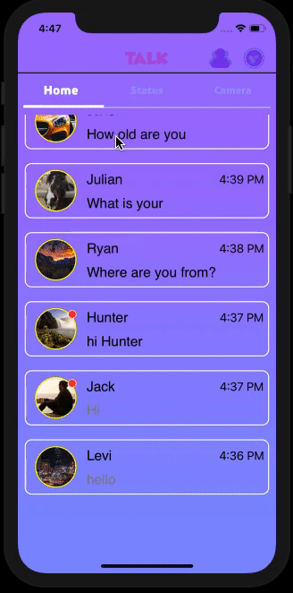

# TalkApp Chat for ios

TalkApp Chat for iOS is a real time chat app written in Swift 5.1 using Firebase.

TalkApp Chat allows to send and receive text messages, status, userblock, camera, image customizer, photos, location & statusdelete automatic for 24 hours.

<h3 align="left">                                      <h3 align="center">
       
</h3>                                                  </h3>
      

<h3 align="right">

</h3>

## Getting Started

To get started and run the app, you need to follow these simple steps:

1. Open the QuickChat workspace in Xcode.
2. Change the Bundle Identifier to match your domain.
3. Go to [Firebase](https://firebase.google.com) and create new project.
4. Select "Add Firebase to your iOS app" option, type the bundle Identifier & click continue.
5. Download "GoogleService-Info.plist" file and add to the project. Make sure file name is "GoogleService-Info.plist".
6. Go to [Firebase Console](https://console.firebase.google.com), select your project, choose "Authentication" from left menu, select "SIGN-IN METHOD" and enable "Email/Password" option.
7. Open the terminal, navigate to project folder and run "pod install". 
8. You're all set! Run Quick Chat on your iPhone or the iOS Simulator.

## Compatibility

This project is written in Swift 5.0 and requires Xcode 11.0 to build and run.

Quick Chat for iOS is compatible with iOS 13.0+.

## Author

* [Haik Aslanyan](https://twitter.com/aslanyanhaik)

## License

Copyright 2019 Haik Aslanyan.

Licensed under MIT License: https://opensource.org/licenses/MIT
